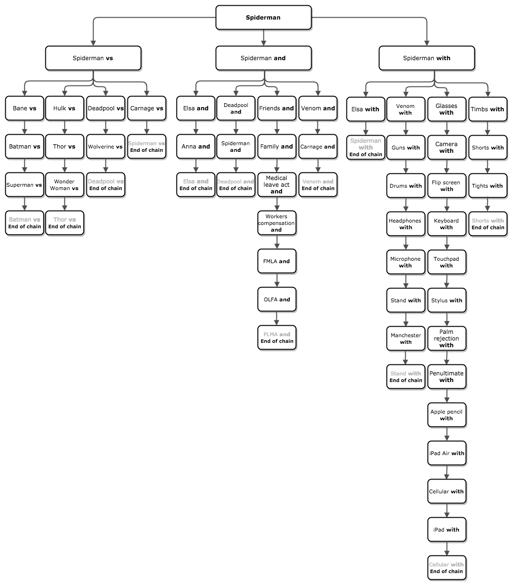
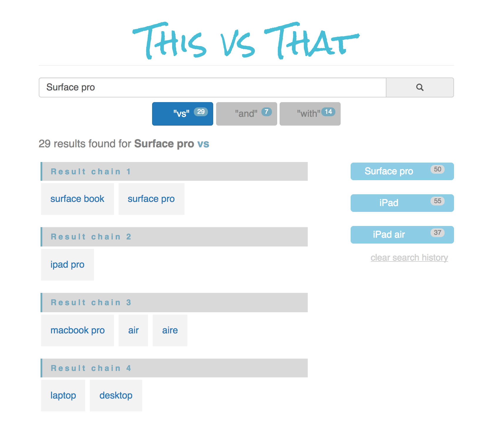

# This vs That

*An automated Google search, which appends commonly used conjunction keywords, (i.e. "vs"), and chains the resulting Google autocomplete suggestions.*

### Available to view [here](https://rawgit.com/VitaC123/This-vs-That/master/index.html) via Raw Git

---

### Detailed description
The app searches through each of Google's autosuggestions, creating a chain of results that terminates upon finding a duplicate result. The chart below is a representation for the search, "Spiderman."

At this point, the app is an experiment, but I could imagine going further, to create a useful consumer research tool. (Try searching for iPad.)

### Other features
* A search history, which allows the user to revisit their results without additional API calls.
* Clickable results. Each result item is a link to an actual Google search. The exact search terms include the previous result, plus the conjunction keyword.

---

